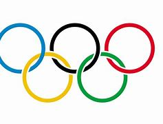

## Documentation de l'Analyse des Jeux Olympiques (JO) 1896-2022

### 1. Introduction

Cette documentation présente une analyse des données des Jeux Olympiques d'été, allant de 1896 à 2022. L'analyse a été réalisée à l'aide de R Shiny, une plateforme permettant de créer des applications web interactives en R. L'objectif de cette analyse est de fournir des insights sur les tendances, les performances des athlètes, et l'évolution des sports au fil des années.

Créer une documentation pour une analyse de données sur les Jeux Olympiques (JO) entre 1896 et 2022 réalisée avec R Shiny est essentiel pour partager vos résultats et méthodes. Voici un exemple de structure de documentation que vous pouvez suivre :

### 2. Objectifs de l'Analyse

- Analyser les performances des pays participants aux JO.
- Évaluer l'évolution du nombre de médailles remportées par nation.
- Explorer les tendances de participation des athlètes au fil des années.
- Visualiser les changements dans le nombre de sports et d'épreuves.

### 3. Données

#### 3.1 Source des Données

 Les données comprennent des informations sur :

- Les athlètes
- Les pays
- Les sports
- Les médailles (or, argent, bronze)
- Les années des JO

#### 3.2 Préparation des Données

Les données ont été nettoyées et préparées pour l'analyse. Cela inclut :

- Suppression des doublons
- Gestion des valeurs manquantes
- Transformation des types de données (par exemple, conversion des années en format numérique)

### 4. Méthodologie

L'analyse a été réalisée en plusieurs étapes :

1. **Chargement des données** : Utilisation de `read.csv()` pour importer les données.
2. **Exploration des données** : Utilisation de fonctions comme `summary()` et `str()` pour comprendre la structure des données.
3. **Visualisation** : Création de graphiques interactifs avec `ggplot2` et des fonctionnalités de R Shiny pour permettre aux utilisateurs d'explorer les données.
4. **Analyse statistique** : Application de tests statistiques pour évaluer les tendances significatives.

### 5. Application R Shiny

L'application R Shiny développée pour cette analyse permet aux utilisateurs d'interagir avec les données de manière intuitive. Les principales fonctionnalités incluent :

- **Sélection de pays** : Les utilisateurs peuvent sélectionner un ou plusieurs pays pour visualiser leurs performances.
- **Graphiques interactifs** : Des graphiques dynamiques montrent l'évolution des médailles au fil des ans.
- **Filtres** : Possibilité de filtrer par année, sport, ou type de médaille.

### 6. Résultats

#### 6.1 Tendances des Médailles

- Visualisation des médailles par pays et par année.
- Identification des pays les plus performants au fil des ans.

#### 6.2 Participation des Athlètes

- Analyse du nombre d'athlètes par pays.
- Évolution du nombre total d'athlètes participants.

#### 6.3 Évolution des Sports

- Visualisation des nouveaux sports ajoutés au programme olympique.
- Analyse de la popularité des sports au fil des années.

### 7. Conclusion

Cette analyse des JO de 1896 à 2022 met en lumière les tendances clés et les performances des nations au fil des ans. L'utilisation de R Shiny permet une exploration interactive des données, offrant une meilleure compréhension des dynamiques olympiques.

### 8. Contact

Pour toute question ou commentaire concernant cette analyse, veuillez contacter crepinkoulo@gmail.com.

---
